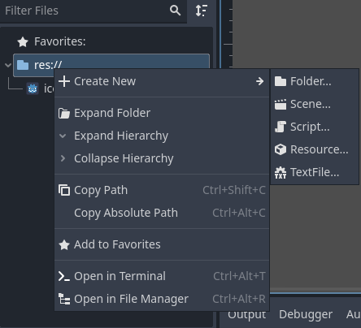
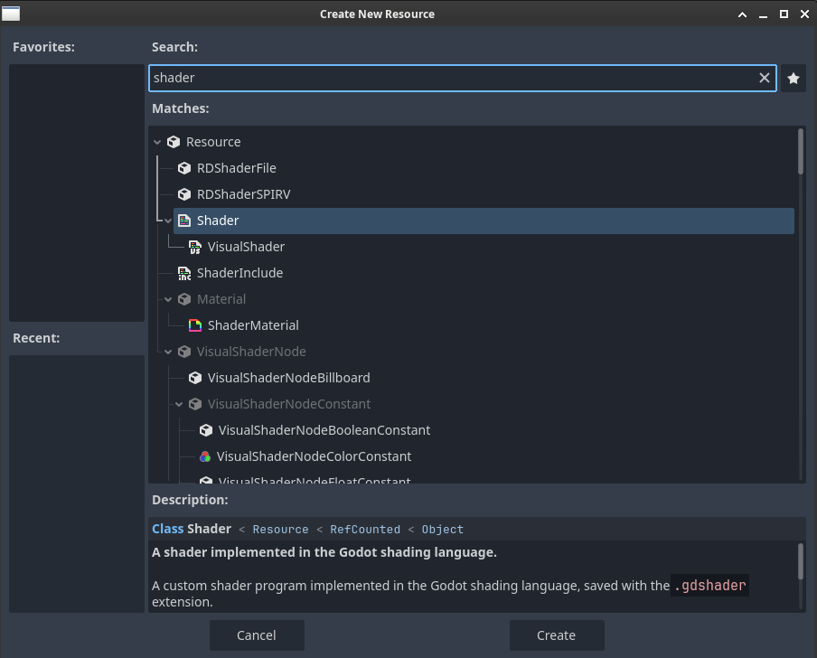
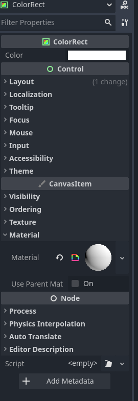
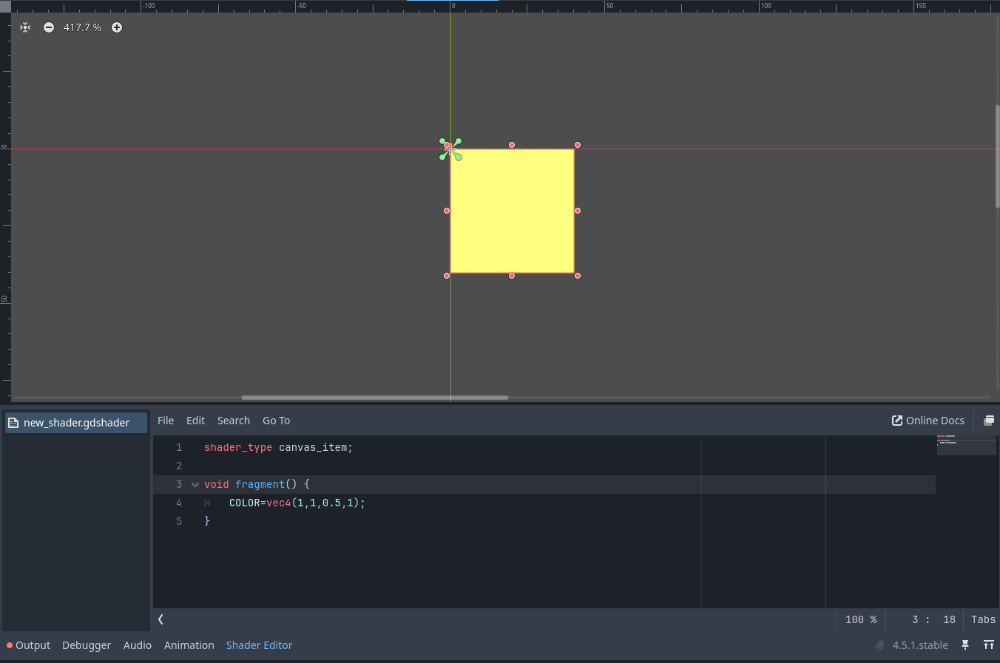

+++
date = '2026-01-05T16:34:22+01:00'
draft = false
title = 'Setting Up'
+++

### Creating the project

Start by launching godot and creating a new project


> [!NOTE]
> The choice of the renderer is not really important for this tutorial **BUT** if you plan to use compute shaders in the futur you should use Forward+ or Mobile otherwise using Compatibility is fine more of this in [the godot documentation](https://docs.godotengine.org/en/stable/tutorials/shaders/compute_shaders.html).

### Setting up the scene

1. Add a new **ColorRect** and save your scene


2. Add a new **ressource** to your project **under the file explorer** of and choose **shader** then open the shader editor



---



---


3. drag and drop the created ressource in the color rect inspector under the CanvasItem > Material



### Writing your first shader

In the shader editor you should have the following code

```glsl {lineNos="true" wrap="true" title="built-in shader code"}
shader_type spatial;

void vertex() {
	// Called for every vertex the material is visible on.
}

void fragment() {
	// Called for every pixel the material is visible on.
}

//void light() {
//	// Called for every pixel for every light affecting the material.
//	// Uncomment to replace the default light processing function with this one.
//}

```
**Code breakdown:**
```glsl {wrap="true"}
shader_type spatial;
```

This is the shader type used, there are 5 shaders types available in godot: 
- spatial
- canvas_item
- particles
- sky
- fog

in this tutorial we'll use canvas_item for 2D rendering.

```glsl {wrap="true"}
void vertex() {
	// Called for every vertex the material is visible on.
}

void fragment() {
	// Called for every pixel the material is visible on.
}
```

shader effects are applied on vertices or pixels, the **vertex()** function applies the effect on every vertex of the object and **fragment** applies it on every pixel.

for our first shader we'll try to change our rectangle color for this we need to use the **COLOR** property and **change our shader type to canvas_item** as follows:

```glsl {wrap="true"}
shader_type canvas_item;

void fragment() {
	COLOR=vec4(1,1,0.5,1);
    //the COLOR property takes a vector4 representing the RGBA of the color with values between 0 and 1 
}
```

you should now see a yellow rectangle!




**Congratulatons** on creating your first shader! it's doesn't do much for now but we'll explore more fun ways to make shaders in futur chapters.